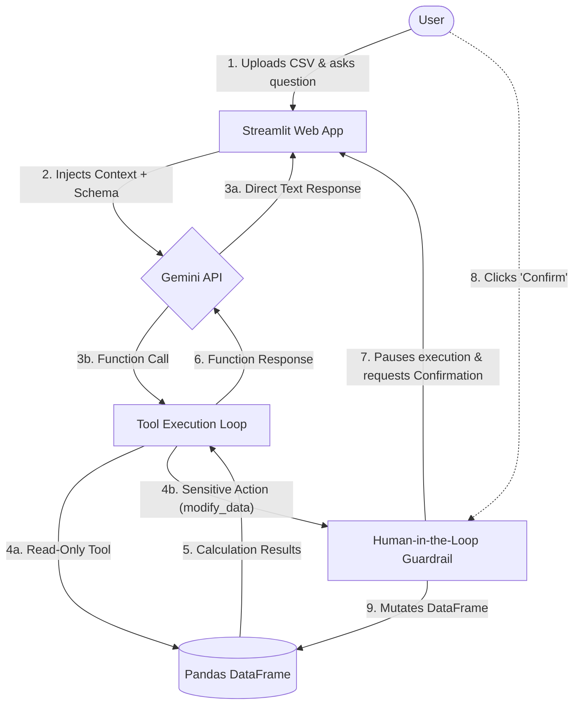

# DataScout — Conversational Data Analysis Concierge Agent 🔎

[](https://datascout-app.streamlit.app/)

**Track:** Concierge Agents  
**Course:** Kaggle × Google — 5-Day AI Agents: Intensive Vibe Coding Course

---

## 1. The Problem & Why It Matters

Exploratory Data Analysis (EDA) is a foundational yet frequently tedious task. It involves a repetitive sequence of mechanical steps—checking summary statistics, detecting outliers, testing correlations, or plotting distributions. Traditionally, this forces analysts and developers to constantly translate business questions into boilerplate code (typically pandas and matplotlib), wasting time on syntax rather than focusing on deriving insights.

For non-technical users, the barrier is even higher. They cannot explore their own data without relying on a data team to build rigid dashboards or handle ad-hoc requests that can take days to resolve.

**DataScout** solves this problem by entirely eliminating the code-translation step. By combining an interactive web environment with the reasoning power of foundational models, it allows anyone to upload a CSV file and converse with their data in plain English. The agent understands the intent, executes the necessary mathematical code in real-time, and returns accurate, data-backed conclusions.

## 2. The Solution: Conversational EDA via Function Calling

DataScout is an **autonomous conversational agent**. Unlike traditional text-based QA chatbots, DataScout is equipped with real Python tools using the Gemini API's **Function Calling** capabilities.

Instead of relying on a hardcoded workflow pipeline, the model acts as an intelligent orchestrator. It has access to 5 specific tools: `describe_data`, `detect_outliers`, `run_correlation`, `plot_chart`, and `modify_data`. When a user asks a question, Gemini autonomously decides which tool to use, extracts the correct parameters from the conversation, asks the backend server to execute the function against the in-memory DataFrame, and uses the actual numerical results to formulate a natural, well-reasoned response.

## 3. System Architecture

DataScout's interaction flow is designed to be secure, stateful, and asynchronous. The entire lifecycle occurs within a web application built with Streamlit.



**Flow Explanation:**
1. The user interacts with the UI and submits a query.
2. Streamlit injects the chat history, the base instructions, and the CSV schema (Dynamic Context Engineering) into the prompt and calls Gemini.
3. If Gemini decides to invoke a tool, an internal **Tool Execution Loop** intercepts the call.
4. Read-only operations are executed immediately in pandas and returned to the LLM to construct its final response. Write operations are caught by the security guardrail.

## 4. Setup Instructions

To run this project locally, follow these steps:

1. **Clone the repository:**
   ```bash
   git clone https://github.com/lopezparrai/datascout-app.git
   cd datascout-app
   ```

2. **Install dependencies:**
   It is recommended to use a virtual environment (`venv` or `conda`).
   ```bash
   pip install -r requirements.txt
   ```

3. **Configure your Gemini API Key:**
   The project uses Streamlit's secure secrets management system to ensure credentials are **never exposed in the source code**.
   - Create a hidden directory and file: `.streamlit/secrets.toml`
   - Add your key (obtained from [Google AI Studio](https://aistudio.google.com/apikey)) using this exact format:
     ```toml
     GEMINI_API_KEY = "AIzaSy_YOUR_KEY_HERE"
     ```

4. **Start the application:**
   ```bash
   streamlit run app.py
   ```
   The web interface will automatically open in your browser (`http://localhost:8501`).

## 5. Security: Human-in-the-loop Guardrail

A fundamental requirement for agentic systems is preventing the LLM from executing destructive actions autonomously (such as deleting critical data due to hallucinations).

In DataScout, the only tool capable of altering the DataFrame's state is `modify_data`. This function implements a strict **Human-in-the-loop (HITL)** pattern. When the model decides to invoke this tool, the application *pauses* the automated execution flow, stores the intent in the session state (`st.session_state`), and renders an explicit confirmation button in the UI (`st.button`).

The data operation **only occurs** if a human user physically authorizes the change by clicking the button. This control is hardcoded at the execution layer in Python, making it impossible to bypass via *prompt injections* or logical LLM deviations. A detailed threat model is available in [SECURITY.md](./SECURITY.md).

## 6. Agent Skills: Separation of Concerns

The project implements the **Agent Skills** pattern, demonstrating a modular architecture. DataScout's persona, ethical constraints, and behavioral configuration are not hardcoded as text strings within `app.py`.

Instead, they live in a standalone text file named [`SKILL.md`](./.agent/skills/datascout-analysis/SKILL.md). The application reads this file at runtime and injects it as the `system_instruction`.

**Benefits:**
- **Maintainability:** The agent's behavior can be version-controlled and fine-tuned by domain experts (Prompt Engineers) without touching the Python logic.
- **Scalability:** It lays the groundwork for the same technical infrastructure to dynamically load different "Skills" to build multi-agent systems in the future (e.g., a data cleaning agent with its own SKILL.md and tools, working alongside the analyst agent).
